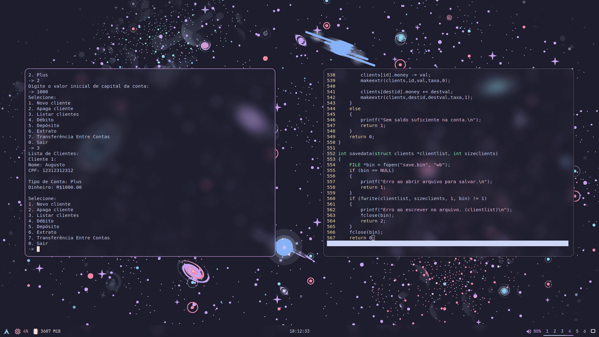

# Cbank

Projeto para o segundo semestre da matéria Desenvolvimento de Algoritmos do curso de Ciência da Computação da FEI.
## Como Usar

Para rodar o código em sua máquina, você precisará do GCC e do repositório baixado.

Como instalar o GCC no Archlinux:

```bash
sudo pacman -S gcc
```

Baixar o repositório e rodá-lo (assumindo que você tem git instalado e está no Linux):

```
git clone https://github.com/augustopereiratx/cbank
cd cbank
./build.sh
```
Você pode ler o arquivo `build.sh` para ver como ele funciona e para mudar ele de acordo com as suas necessidades.
## Fotos


